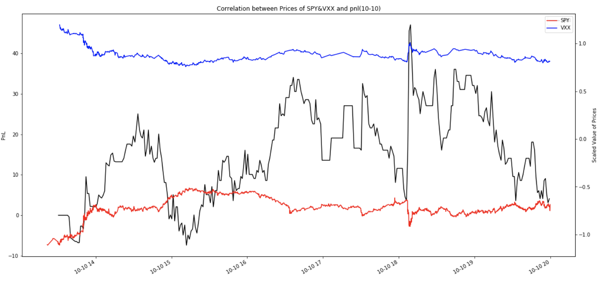

**Group Info:**

Jialing Zhu jz72@illinois.edu - MSFE

Jiaqi (Ivan) Su jiaqisu2@illinois.edu - MSFE

Guancheng Guo gguo5@illinois.edu - MSFE

Lingyu He lingyuh2@illinois.edu - MSFE

**Project Structure:**

- GroupOneStrategy: This contains the C++ codes for our strategy 
- backtesting-cra-exports: This contains the results of running backtest on our strategy 
- python_src : This contains the Python codes for our correlation analyses 
- backtest_archive: This contains the backtesting results of our intial (non-optimized) strategy

---

# Group One Strategy Report: A high-frequency trading strategy on VXX triggered by SPY

## Introduction

In this project, we used the SPY and VXX as our trading symbols, and conducted research on correlations between SPY and VXX, then built our trading strategy based on the correlations.

## Background

SPY is the ticker symbol for SPDR S&P 500 Trust ETF. It is a fund that aims to track Standard & Poor's 500 index which is a market index that keeps track of the performance of the stocks of the 500 large companies in different industries listed on the U.S stock exchange. It is often used as the benchmark of the United States equity market and economy[1] as it’s a well-diversified basket of common stocks in multiple industries. ETF is the abbreviation of the exchange-traded fund, which is a fund that can be traded in an exchange, just like stocks.

VXX is an abbreviation of the iPath S&P 500 VIX Futures, which is an exchange-traded note (ETN) designed to provide exposure to equity market volatility for investors. ETN is structured as a debt instrument, can be bought, and sold like stock [2]. VXX usually increases when the S&P 500 declines, which means they have a negative correlation in most situations, the hypothesis is supported by the graphs and data analysis in the next section of the report and is used to construct our strategy.

Since SPY and VXX track the performance of a selection of stocks and have less exposure to the risk of individual stocks, we choose VXX and SPY as the assets to study in our project. SPY and VXX are derived from the stock prices of a selection of stocks trading in the market, and they represent the “market performance” rather than performance of certain stocks in a specific industry which could be affected greatly by a single event happening to a specific industry or company.
 
## Pre-implementation Research

At the beginning, we want to find out the leading indicator, SPY or VXX. So we lagged the VXX tickets, and to see the correlation between the price change percent of lagged VXX and non-lagged SPY. From the following plot we can see it seems to be zero reversion, which means sometime SPY leads, sometime VXX leads.

After that, we calculate  the correlation correlations between the price change of the VXX and SPY per hour/minute, we found that the price change of VXX and the price change of SPY are negatively correlated.
The average correlation of the price change of VXX and SPY per minute within 24 trading days is  -0.5189110926715399.
The average correlation of the price change of VXX and SPY per hour within 24 trading days is  -0.6290116674372686.
We can also see it from the following plots.

The following plot is the correlation between price change of VXX and SPY within 10 milliseconds. Here we dropped all the ticks without price change within 10 milliseconds, because in many situations, SPY and VXX did not change, and it would lower the actual correlation.

So we build the strategy based on the negative correlations between the price change of VXX and SPY. When SPY price goes up and we do not have VXX we will short VXX, or clear VXX position if we have VXX positions; If SPY price goes down, we will buy VXX.

## C++ implementation (non-optimized version)

In order for this strategy to work, we need to use two double-ended queues: “current_50_trades” and “lagged_50_trades” to store the trade prices to compute the moving average. Our group decided to use a double-ended queue because it can be expanded or contracted on both its front and back so that we can freely add or remove the trade prices. First, we assign “SPY” to “m_instrumentX” and “VXX” to “m_instrumentY”. In order to compute the moving average of current 50 trades prices, we need to remove the oldest trade price from the “current_50_trades” queue and add the least trade price to the queue. Adding or removing trade prices dynamically enables us to always use the latest trade prices to compute the moving average of the current 50 trades. The “lagged_50_trades” queue stores the lagged 50 trade prices. In other words, it does not contain the most current trade prices. Now, the trade prices stored in “current_50_trades” and “lagged_50_trades” are transferred to the variables “ma_first” and “ma_second”, respectively” to compute the moving averages. Importantly, we need to wait until we have at least 51 trades to begin our strategy; otherwise, it is impossible for us to compute the average of current 50 trade prices or last 50 trade prices. Furthermore, we need a threshold for our strategy to work, which is determined by using the median of the absolute values of the last 50 SPY ticks moving average price changes among the beginning 10 trade days. The threshold value itself obtained via our statistical analysis is 0.00025. Finally, our strategy is simply defined in the following illustration:

,
where hold position is a boolean which tracks if we have current position.

We update “trade_count” every time and transfer the data stored in “current_50_trades” to “lagged_50_trades” after we execute every order (buy/sell 100 VXX) so that we have the latest information to continue our strategy. In addition, we also set an integer trade_num which keeps track of how many trades we make every day and an integer max_trade_number  to limit the maximum trade number we can execute every day. This is designed mainly for debugging. During the backtest, “max_trade_number” is set to a very large integer to remove this limitation.
 
## Backtesting Results Analysis & Optimization

Examining the backtesting results of our initial strategy, we realized that our threshold is too small and therefore we increased our threshold from 0.00025 to 0.00040. Indeed, we observed better results after the increase of the threshold. furthermore, we found that our strategy starts losing money on Oct 14 and there is an abnormal vertical decline on our PNL graph. By looking further into the event that caused us to lose money, we discovered a bug in our initial strategy. At the beginning of certain trading days, there are a number of SPY trade updates coming in, while there are no VXX trades. This caused our strategy to keep submitting buy orders at the first minute of the trading day. All the orders get filled later and are not closed until the end of our backtesting period. To solve this problem, we added a piece of code that prevents our strategy from sending orders in the first minutes of each trading day. We also realized that there is a significant intra-day risk and we should not hold our position overnight. As a result, we added a block of code that stops our trading activity and close our position when we are in the last minutes of each trading day. Additionally, we utilized OnResetStrategyState() to reset our parameters at the beginning of each trading day. 

After we fixed the problem, our strategy can profit during the backtest period (2019-10-10 to 2019-10-30). Both SPY and VXX fluctuated during this period, but our strategy is able to generate stable profit. By the end of the backtest period, our strategy made 2383 trades and generated 912.76 USD profit. The plot of the first trading day is included in the report while the rest of the PNL graph is included in the gitlab repo.
 
## 2020 Backtest Result

In order to test the profitability of our project during an abnormal period, namely during the 2020 pandemic, we backtested our strategy in a period starting from Jan 1, 2020 to Mar 30, 2020. Our strategy behaved normally until late February. It generates some profit at the beginning of January and then starts losing money later in that month. The reason for that is probably at the end of January the market starts rallying, with S&P 500 going up to its historical highest point. As a result, VXX remained low during that period while SPY went up rapidly and we got hurt by the SPY/VXX level change discrepancy. However, when it came to the end of February, the market started to drop due to COVID-19 concerns and our profit skyrocketed. From the end of February to the end of March, the market dropped rapidly, with VXX rallying. The threshold of our strategy is fixed, but during this period the volatility of the market increased by a lot. Consequently, we are making a lot more trades every day. Furthermore, our strategy only allows us to take a long position, so we took full advantage of the VXX price increase.
 
## ToubleShooting:

Throughout the project, we experienced following problems: 
* We sent orders to wrong exchanges. During the development of our strategy, we sent orders to COBE and NASDAQ instead of IEX. Consequently, none of the order got executed.
* We did not update the compiled strategy into the correct path.
* We changed the username to our group name instead of dlariviere, so the backtesting engine will not take in our strategy because the author is not in the database
* At the beginning of certain trading days, there are a number of SPY trade updates coming in, while there are no VXX trades. This caused our strategy to keep submitting buy orders at the first minute of the trading day. 
